# User Manual

This manual covers both web interfaces, the frame's day-to-day behaviour, and where to find more detail. For installation and first-time setup see [install.md](install.md).

## Contents

1. [The web app](#1-the-web-app)
   - [1.1 Opening the app and switching interfaces](#11-opening-the-app-and-switching-interfaces)
   - [1.2 The gallery](#12-the-gallery)
   - [1.3 Opening a photo: detail and actions](#13-opening-a-photo-detail-and-actions)
   - [1.4 Uploading photos and watching progress](#14-uploading-photos-and-watching-progress)
   - [1.5 Your frames](#15-your-frames)
   - [1.6 Settings](#16-settings)
   - [1.7 Server information](#17-server-information)
2. [The classic interface](#2-the-classic-interface)
   - [2.1 Images](#21-images)
   - [2.2 Screens](#22-screens)
   - [2.3 Config](#23-config)
3. [The frame itself](#3-the-frame-itself)
   - [3.1 Buttons and LEDs](#31-buttons-and-leds)
   - [3.2 Error messages](#32-error-messages)
   - [3.3 Sleep and power](#33-sleep-and-power)
4. [Going deeper](#4-going-deeper)

---

## 1. The web app

Hokku comes with two web interfaces, and both talk to the same server, so your photos, frames, and settings are shared between them. The **modern app** is the default: it is built mobile-first, works equally well on a phone or a computer, and is what the rest of this section describes. The original **classic page** is unchanged and still available — it is documented in [section 2](#2-the-classic-interface). Open either one at `http://<your-server>:8080/` from any browser on your network.

### 1.1 Opening the app and switching interfaces

*The gallery — the app's home screen, on a computer.*

The modern app gives you a photo gallery, a detail view that previews how each photo will look on the six-colour screen, management of your connected frames, and every setting in one place. Because it shares the same server as the classic page, nothing about your frames or library changes when you move between them.

> **Switching between the two**
>
> Both interfaces are always available:
>
> - **Modern app** — `http://<your-server>:8080/hokku/app`
> - **Classic page** — `http://<your-server>:8080/hokku/ui`
>
> The plain address `http://<your-server>:8080/` opens whichever one you set as the default. To choose, open your `config.json` and set `"default_ui": "modern"` for the new app, or `"classic"` for the original (the built-in default). The change takes effect the next time you open the page — no restart needed.

### 1.2 The gallery

The gallery is the app's home screen, and it looks and works the same on a phone or a computer.

**Live previews** — every photo appears as a thumbnail of its **converted** six-colour render (what the frame will actually display, not the original), so you can catch anything that dithers poorly before it goes on the wall. The most recently uploaded photos appear first.

**Arrangements** — the tabs at the top change the layout: **Mixed** lays every photo out in one flowing grid, **Grouped** splits them into Landscape and Portrait sections, and **Landscape** or **Portrait** show just one shape.

**Thumbnail size** — the slider beside the tabs makes the thumbnails larger or smaller in any arrangement. On a phone, pinch the grid to zoom in and out instead.

**Frame chips** — a photo that is currently on a frame carries a small coloured chip with that frame's name in its corner (a green “Living Room” chip, a blue “Studio” chip, and so on), so you can see at a glance which photo is on which wall. Every frame has its own colour, used consistently throughout the app.

**Status badges** — a photo still being converted shows a **Converting** badge; anything that failed to convert is set aside in the failed panel (see [1.4](#14-uploading-photos-and-watching-progress)).

<a href="../images/ui_v2_mobile.png">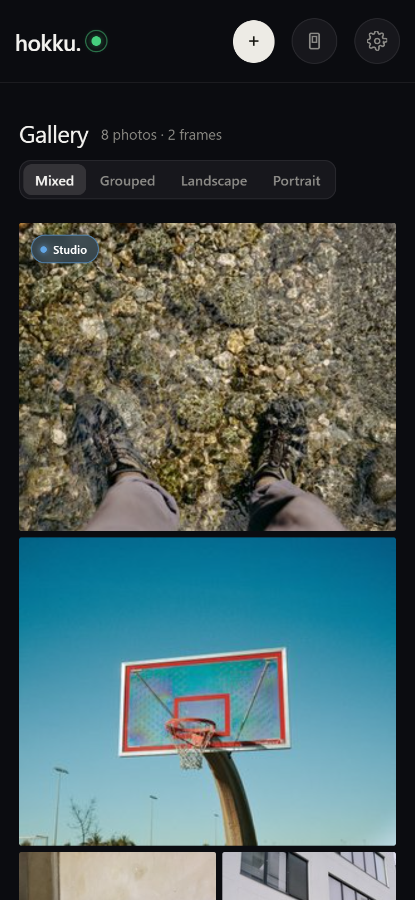</a>

*The same gallery on a phone; pinch to resize the grid.*

### 1.3 Opening a photo: detail and actions

**Opening it** — on a computer, **click** a photo to open its detail view, or **right-click** it (or use the **⋯** button in its corner) to reach its actions without opening the full view. On a phone, **press and hold** a photo to bring up its action sheet, then choose **View details** to open the detail view — every action, opening the detail included, lives in that sheet.

<a href="../images/ui_v2_detail.png">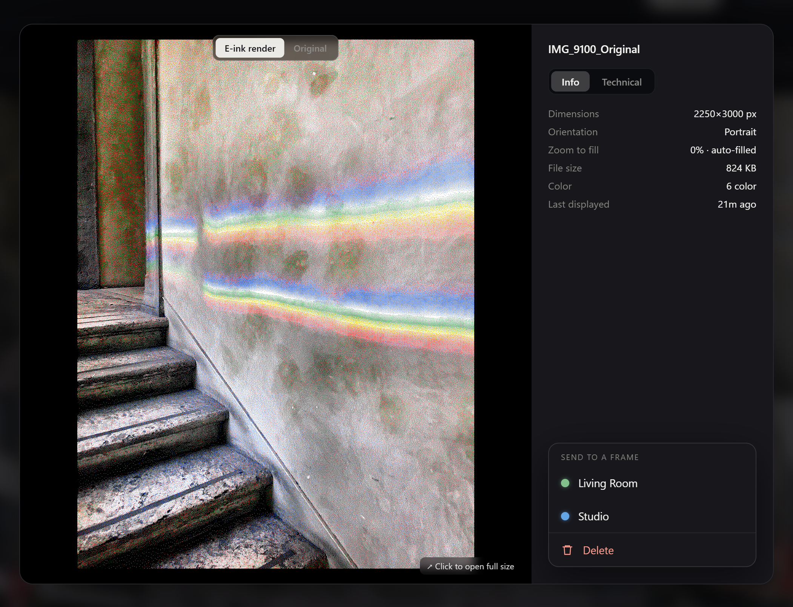</a>

*The detail view: the six-colour E-ink render, photo info, and actions.*

**Two views** — the toggle at the top switches between the **E-ink render** (how it will look on the frame) and the **Original**.

**Info and Technical** — two tabs beneath list the photo's details: dimensions, orientation, file size, colour or black-and-white, how much zoom-to-fill it needs, when it was last displayed, how many times it has been shown, its conversion time, and how many faces were detected.

**Faces** — if the photo contains faces, a **Faces** button on the Original view outlines them.

**Open full size** — click the image itself to open it full size in a new tab.

**On display and Up next** — when a frame is showing this photo, an **On display** line names the frame; when it is queued to show on a frame next, an **Up next** line shows which frame and when.

<a href="../images/ui_v2_ctxmenu.png">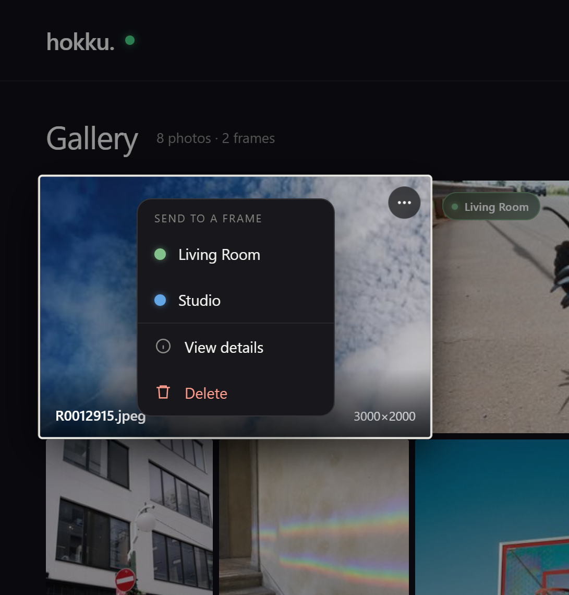</a>

*Right-click a photo (or use its ⋯ button) for the actions, including Send to a frame.*

In normal use the server rotates through your library fairly — every photo gets equal screen time, with new uploads going first. **The actions** on a photo let you step in, and they are the same wherever you open them:

- **Send to a frame** — with more than one frame connected, choose which frame should show this photo at its next refresh. If the photo's orientation does not match the frame's, Hokku asks you to confirm (“… shows landscape — send anyway?”) before sending.
- **Show next** — with a single frame, queue the photo to be shown next.
- **View details** — open the full detail view (from the menu or the action sheet).
- **Delete** — remove the photo and all of its cached renders; a second tap confirms.
- **Retry conversion** and **View error** — shown in place of the above for a photo that failed to convert.

On a phone, the press-and-hold sheet shows the same list, with a preview of the photo above it.

<a href="../images/ui_v2_mobile_sheet.png">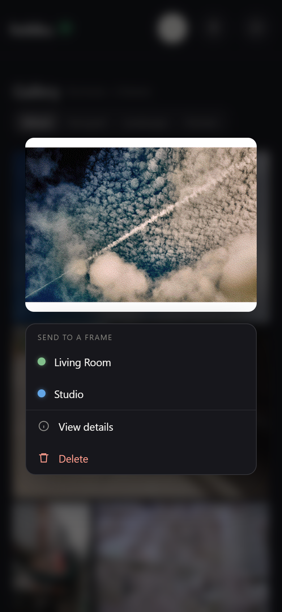</a>

*On a phone, press and hold a photo for the same actions.*

<a href="../images/ui_v2_mobile_detail.png">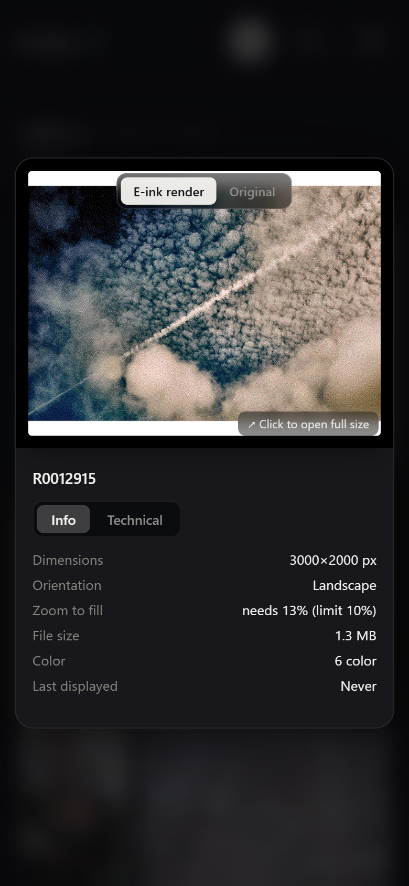</a>

*The detail view on a phone.*

### 1.4 Uploading photos and watching progress

**Adding photos** — use the **Upload** button, or drag files anywhere onto the page; you can add many at once. Hokku accepts JPEG, PNG, HEIC/HEIF, AVIF, WebP, and JPEG XL, and rotates phone photos to their correct orientation automatically. On a phone, Upload opens your camera roll.

<a href="../images/ui_v2_upload.png">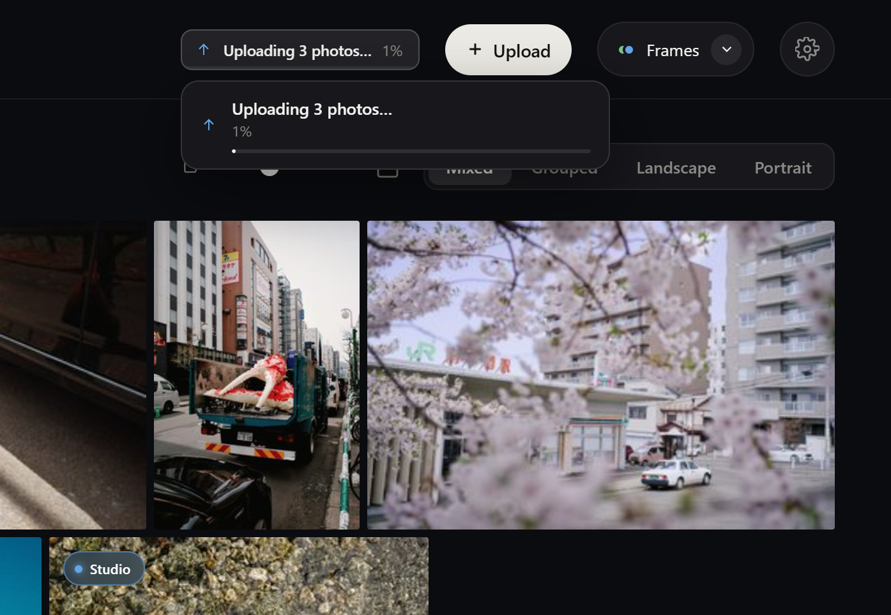</a>

*Uploading: the progress tile and its popover at the top of the header.*

**Upload progress** — while photos upload, a tile in the header shows how many are in flight and the percentage complete; click it for a popover with the full progress.

<a href="../images/ui_v2_progress.png">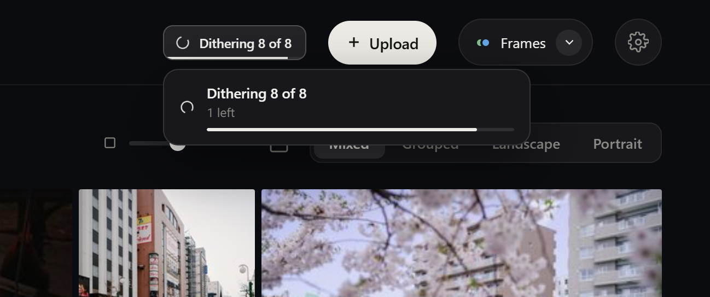</a>

*Converting: the same tile counts down each photo with a time estimate.*

**Conversion** — once an upload finishes, each photo is converted to the six-colour palette in the background, and the tile switches to a converting count with a rough time estimate. The server adapts the conversion to each photo — black-and-white images and faces are detected locally and handled differently (see [dithering.md](dithering.md)) — and gallery thumbnails appear as each one finishes, so you never have to wait.

**Failed photos** — occasionally a photo can't be converted (a corrupt file, one too large to decode, or an unsupported format). It isn't lost: a **failed** tile summarises how many, and its **Review** action lists each one with its error so you can retry or delete them, individually or all at once.

### 1.5 Your frames

**Opening the panel** — the **Frames** button in the header opens a panel of every frame that has connected to this server. On a computer it drops down and stays open while you browse the gallery.

<a href="../images/ui_v2_frames.png">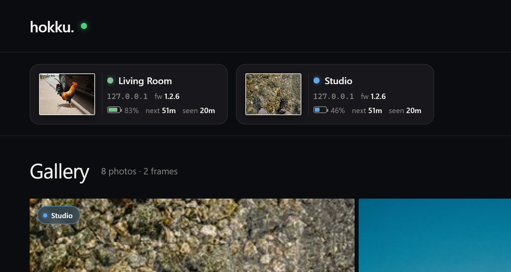</a>

*The Frames panel: one card per connected frame.*

**Each frame card** shows a thumbnail of the photo it is currently displaying, the frame's name and colour dot, its IP address and firmware version, its battery level (flagged red below 20%), when it was last seen, and when it is next expected to check in. A frame that has missed its expected check-in is flagged **Overdue**. An **Up next** thumbnail shows what it will display next — or **Pinned**, if you have sent a specific photo to it, which you can cancel here.

**How frames connect** — a frame doesn't hold a live connection; it wakes on schedule, fetches an image, and returns to deep sleep. The panel only updates when a frame checks in, so “last seen 12 hours ago” is normal, not a fault.

<a href="../images/ui_v2_diagnostics.png">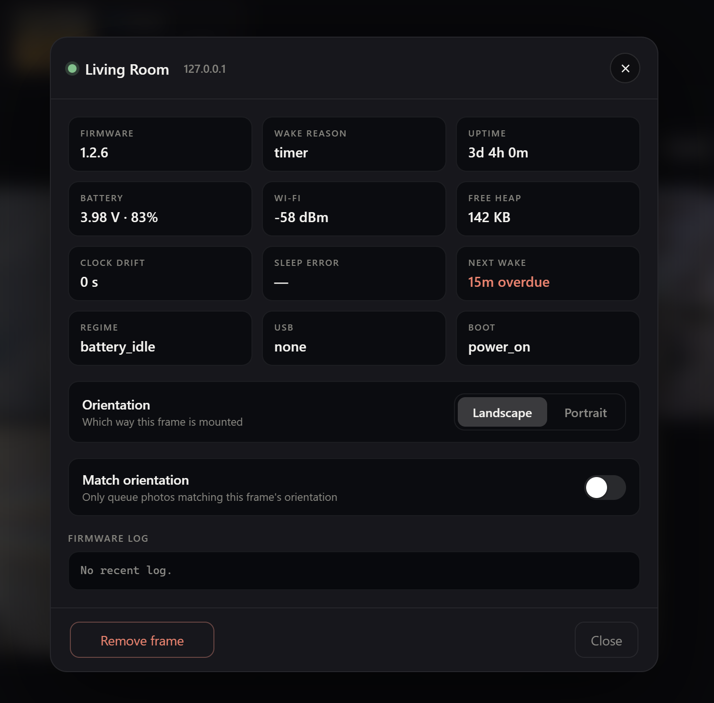</a>

*View diagnostics: the frame's full self-reported state.*

**View diagnostics** — the **⋯** button on a card opens its menu. **View diagnostics** shows everything the frame reports about itself — firmware, wake reason, uptime, battery, Wi-Fi signal, free memory, clock drift, next wake, and the raw firmware log from its last few refreshes — enough to see why a refresh failed without reaching for a cable.

**Orientation** — the diagnostics panel is also where you set the frame's orientation (Landscape or Portrait) and whether it should be sent only photos matching that orientation.

**Remove a frame** — the same **⋯** menu has a **Remove frame** option.

<a href="../images/ui_v2_mobile_frames.png">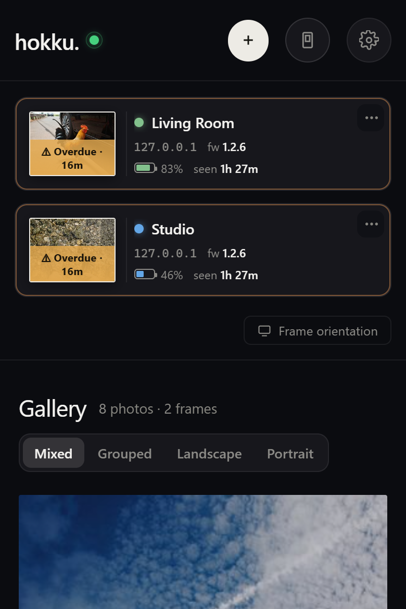</a>

*The Frames panel on a phone.*

**Multiple frames** — you can run as many frames as you like from one server. Each is tracked separately, keeps its own orientation, and draws from the same photo library.

### 1.6 Settings

**Opening Settings** — the **gear** button opens Settings. On a computer the categories sit beside the controls; on a phone you get a simple list and tap a category to drill in, with a back arrow to return.

<a href="../images/ui_v2_settings.png">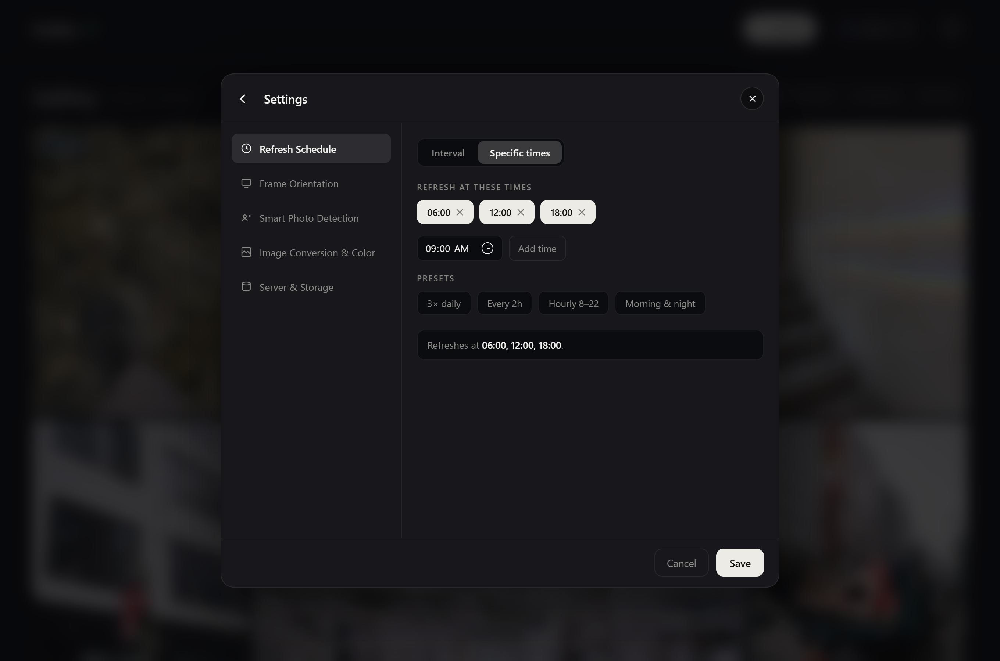</a>

*Settings on a computer — the refresh schedule.*

**The categories:**

- **Refresh Schedule** — how often each frame wakes to fetch a new photo: an **interval** (every 15 minutes up to 24 hours, optionally only during set hours so the battery lasts longer), or a list of **specific times**. The server computes each frame's sleep for you; a live line shows what's next.
- **Frame Orientation** — set each connected frame to Landscape or Portrait, and whether it should be sent only matching photos (the same controls as in a frame's diagnostics).
- **Smart Photo Detection** — whether Hokku detects black-and-white photos and faces and routes each to a conversion tuned for it, with an option to protect faces from local-contrast boosting. It all runs on your own server; nothing leaves your network.
- **Image Conversion & Colour** — the default dither preset, and how far a photo may be zoomed to fill the frame rather than showing letterbox bars.
- **Server & Storage** — how often the app polls for updates, the debug screen, automatic cache clearing, the mDNS/Bonjour name, how many photos convert in parallel, and a button to clear all caches and reconvert.

&nbsp; 
&nbsp; 
<a href="../images/ui_v2_mobile_settings.png">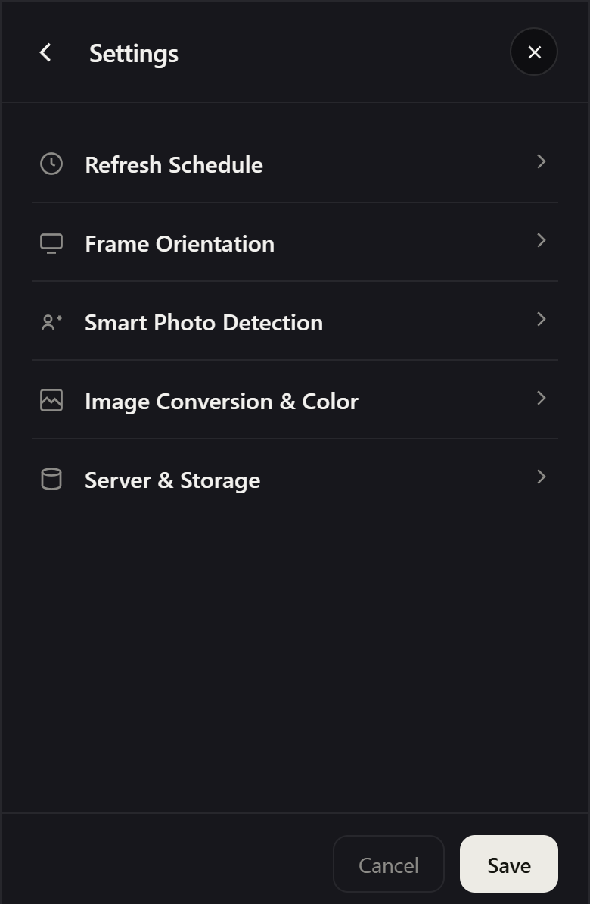</a>

*On a phone, Settings is a list you drill into.*

**Custom dither editor** — any conversion preset can be opened for fine tuning with its **Custom…** button, which brings up the dither editor on a computer.

<a href="../images/ui_v2_dither.png">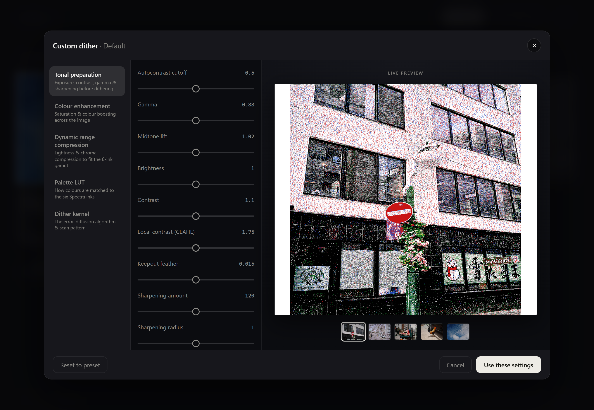</a>

*The custom dither editor, with a live six-colour preview.*

The editor groups every conversion control into five stages — tonal preparation, colour enhancement, dynamic-range compression, palette matching, and the dither kernel — and shows a **live preview** of a real photo rendered with your current settings, updating as you adjust each control. Choose a different preview photo from the row beneath it. For a full explanation of what each control does and why the defaults are what they are, see [dithering.md](dithering.md).

### 1.7 Server information

**The wordmark** — the “hokku.” wordmark in the top-left corner is also the server button, with a green dot when the app is connected to the server. It shows your server's own name: name the server `maestro` during setup and the wordmark reads “maestro.”. Click it for server information.

**On a computer** — this opens a drawer with the server's address, version, cache size and a **Clear cache** button, free disk space, CPU, free memory, the number of active conversion workers, and the last photo served.

<a href="../images/ui_v2_server.png">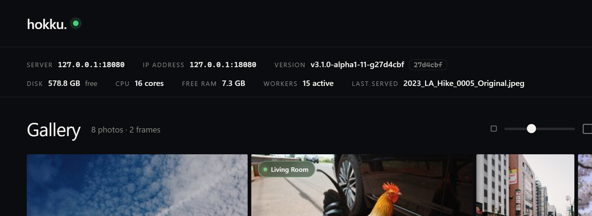</a>

* Clicking the wordmark opens server info — a drawer on a computer.*

**On a phone** — the same details open as a clean panel grouped into **Server**, **System**, and **Activity**, with Clear cache at the bottom.

<a href="../images/ui_v2_mobile_server.png">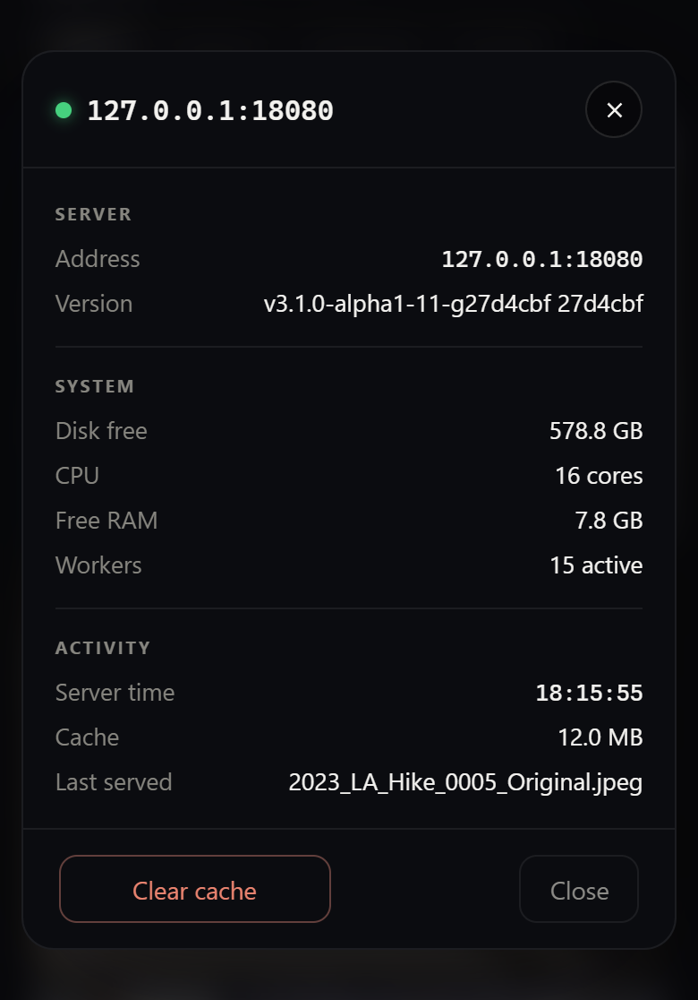</a>

*On a phone the same information opens as a panel.*

**The footer** — the current server time and version also appear in the footer at the bottom of every page.

> The classic interface — the original Images / Screens / Config page — is unchanged and documented next, in section 2. 
> 
> Screenshots use only the repository's licence-cleared sample photos; never personal photos.

---

## 2. The classic interface

The classic page is the original web interface, unchanged. Open it directly at `http://<your-server>:8080/hokku/ui`. It has three sections (tabs) across the top, and everything updates live without a page reload.

### 2.1 Images

The Images tab is your photo library. Every photo you've uploaded appears here as a thumbnail showing the converted version — what the frame will actually display, not the original. This matters because e-ink has only six colours and images are converted using a dithering process that can look quite different from the original on certain types of photo. Seeing the result before it goes on the wall is one of the key reasons to use this software over the stock firmware.

**Uploading photos** — drag files anywhere onto the page, or click the upload zone to browse. You can drop dozens of files at once; a live list shows each file's progress as it uploads. The server accepts JPEG, PNG, HEIC/HEIF, AVIF, WebP, GIF, TIFF, BMP, and JPEG XL — anything from old scanned prints to recent iPhone, Android, or JPEG XL photos. Phone photos are automatically rotated to match their EXIF orientation tag, so a portrait shot taken on a phone doesn't arrive sideways.

**Conversion** — after uploading, each image is converted to the frame's six-colour palette in the background. This takes a few seconds per image depending on your server hardware. While conversion is in progress a status strip at the top of the page shows how many images are queued and a rough time estimate. You don't need to wait — the page updates live and thumbnails appear as each conversion finishes.

The conversion process is smarter than a simple filter. The server analyses each image before converting it: black-and-white photos are detected and routed through a pipeline tuned for monochrome, and photos containing faces get special treatment to preserve skin tones. All of this runs entirely on your server — nothing is sent anywhere. For a full explanation of how the conversion pipeline works and why certain choices were made, see [dithering.md](dithering.md).

**Failed conversions** — occasionally an image can't be converted, usually because the file is corrupt, too large to decode within the memory budget, or in a format the server doesn't fully support. These don't silently disappear: they appear in a separate Failed panel below the grid with the error message and the filename. You can delete individual failed entries or clear them all at once, and retry if you think the error was transient.

**Previewing** — click any thumbnail to open the details view.

The details view shows the original and the converted version side by side at full size, so you can judge exactly how well the conversion worked for that particular photo. It also shows the source dimensions, which conversion algorithm was used (the server picks automatically, but you can override per-image in Config), and how long the conversion took. If the converted version doesn't look right you can adjust the dither preset in Config and use the Clear Cache & Re-convert button to regenerate everything.

**Queue control** — each thumbnail has a "Show next" button that immediately queues that photo to be shown on the frame at its next refresh. Use this when you want a specific photo on the wall without waiting for normal rotation. The server uses a fair rotation algorithm — each image gets equal screen time over the long run, with newly uploaded photos jumping to the front of the queue. The "Show next" button effectively sets an image's priority to maximum.

**Deleting** — the trash button on each thumbnail deletes the original and all cached conversions. The frame will never show that image again.

### 2.2 Screens

The Screens tab shows every frame that has ever connected to this server. Each entry in the dashboard displays:

- **Name** — the screen name you gave the frame during setup. If you have multiple frames this is how you tell them apart.
- **Battery level** — shown as a percentage with a colour indicator. Drops below 20% and it turns red. The frame reports its battery level on every refresh so this is always current as of the last check-in.
- **WiFi signal** — the frame's signal strength at the time of its last refresh. Useful for diagnosing frames that are inconsistent updaters.
- **Last seen** — when the frame last fetched an image. If this is hours ago and the frame is supposed to be on a regular schedule, something is probably wrong.
- **Next update** — when the server expects the frame to check in next, calculated from the refresh schedule and the sleep duration the server told it to use. A frame that hasn't appeared by this time gets flagged with an overdue warning.
- **Diagnostics** — a one-click modal that shows the frame's self-reported state: firmware version, boot count, wake cause (timer vs button), free memory, and more. Useful for diagnosing problems without needing a serial cable.
- **Last log** — the bottom of the diagnostics modal shows the raw firmware log from the last few refresh cycles, timestamped. The frame accumulates log output in a small buffer that survives deep sleep, then uploads it to the server as part of every refresh. Each entry covers WiFi connection, image download, display result, and anything else the firmware logged — essentially a post-mortem for the most recent activity. If a refresh failed silently, the log shows exactly where and why without needing a cable or a serial terminal.

**How frames connect** — the frame calls the server on its refresh schedule, receives the next image and a sleep duration in the response headers, and goes back to deep sleep. It doesn't maintain a persistent connection. This means the Screens table only updates when a frame checks in — a frame that's been asleep for 12 hours will show its last-seen time as 12 hours ago. That's normal.

**Multiple frames** — every frame that connects is tracked independently. You can run as many frames as you like from a single server. Give each one a distinct name during setup so you can tell them apart in the dashboard. Each frame follows the same global refresh schedule and image pool.

**Per-screen orientation** — each frame carries its own orientation, set in the Screens tab. A frame mounted in portrait can show portrait-rendered images while another in landscape shows landscape ones, both served from the same library. A brand-new frame defaults to landscape until you change it.

### 2.3 Config

The Config tab controls how the server behaves and how images are converted. All changes take effect immediately — there's no save-and-restart cycle, and the frame picks up any configuration changes on its next scheduled refresh without reflashing.

**Refresh schedule** — how often the frame wakes to fetch a new image. There are two modes, chosen with the toggle:

- **Interval** — refresh every *N* (pick a preset: 15m up to 24h). Optionally restrict it to an **active-hours** window (e.g. only 07:00–23:00), so the frame skips overnight refreshes and the battery lasts longer.
- **Specific times** — the classic list of clock times. Pick a time and press Add, remove any with the ✕, or start from a preset (3× daily, every 2h, hourly 8–22). The frame wakes at each of these times.

Either way, the server computes the sleep duration (using the timezone set on the server OS, not here) and sends it to the frame with every response; a live "next refresh in…" line shows what the frame will do next. Between refreshes the frame draws no meaningful power — see [Sleep and power](#33-sleep-and-power).

**Image workers** — how many photos the server converts in parallel. Set to Auto and the server picks based on available CPU cores and memory. Set it higher on a faster machine to convert large libraries faster; set it to 1 on very constrained hardware. Each worker uses around 50 MB of RAM during conversion.

**Crop to fill** — when a photo's aspect ratio is close to the frame's but not exact, the server can crop slightly rather than showing a thin letterbox band. The threshold controls how much cropping is acceptable (e.g. 0.05 = up to 5%). Set to 0 to always letterbox. See [dithering.md](dithering.md) for more detail on how this interacts with the conversion pipeline.

**Dither preset** — three curated presets cover the common cases: a hue-aware Floyd–Steinberg conversion (smooth gradients, faithful colours), a B&W-safe variant that disables colour-boosting (for black-and-white scans), and a hue-aware Atkinson conversion (bolder contrast, punchier output — the default for face detection). There are three independent preset slots: one for general images, one for detected black-and-white photos, and one for detected faces — so the server can route each kind of photo to the conversion that suits it best. Beyond the presets, the **Custom…** button opens an advanced panel with every individual knob exposed: palette LUT (CIELAB, weighted CIELAB, OKLAB, CAM16-UCS, each with optional hue gating, plus a B&W-only LUT), error-diffusion algorithm (Floyd–Steinberg, Atkinson, Stucki), per-stripe adaptive saturation (off / CIELAB / OKLAB), and dynamic-range compression with independent CIELAB/OKLAB selectors for lightness and chroma. Changing any setting doesn't automatically re-convert existing images — use the **Clear Cache & Re-convert** button to regenerate everything. For a full explanation of what each setting does and the reasoning behind the defaults, see [dithering.md](dithering.md).

**Context-aware conversion** — two toggles control whether the server analyses image content before choosing a conversion approach. B&W detection identifies monochrome photos and routes them through a separate pipeline tuned for black-and-white rather than colour dithering. Face detection identifies photos containing faces and routes them through a pipeline that prioritises skin tone rendering — all detected faces, not just the largest one. Both run entirely locally using on-device models — nothing leaves your network. You can disable either toggle if you prefer a single consistent approach across all images, or if the detection is occasionally misclassifying something.

**CLAHE face protection** — located in the Config tab, directly below the Context-aware conversion toggles. This toggle is only visible when face detection is turned on.

- **What CLAHE is:** CLAHE (Contrast Limited Adaptive Histogram Equalization) is a local-contrast boost applied during image conversion. It analyses the image in small tiles and stretches contrast within each tile independently, which pulls out shadow detail and highlight texture that a global adjustment would miss. The trade-off is that it can shift skin tones noticeably, making portraits look unnatural.
- **What the toggle does:** When enabled, detected face regions are excluded from the CLAHE step entirely. The rest of the image still gets the contrast boost; only the pixels inside detected face bounding boxes are left at their pre-CLAHE values. This is the default when face detection is on. Disabling the toggle applies CLAHE uniformly across the whole image, including faces.
- **Feathering:** Rather than a hard cut at the face boundary, a short Gaussian blur is applied to the edge of the protected region so the transition blends smoothly into the surrounding CLAHE-processed area. This prevents a visible ring around each face.

**Poll interval** — how often the web app checks the server for status updates (queue progress, new images, screen check-ins). Default is 10 seconds. Raise it if you want to reduce network chatter on a slow connection; lower it if you want near-instant updates during large uploads.

**Clear Cache & Re-convert** — wipes all converted images and regenerates them from the originals using the current settings. Use this after changing dither preset or crop-to-fill threshold. The process runs in the background; the status strip on the Images tab shows progress.

**Config file options** — a few settings can't be changed from the web app and need to be edited in the config file directly (`/var/lib/hokku/config.json` on a deb install, or `./config.json` from source). These are:

- **`mdns_hostname`** — the mDNS/Bonjour hostname the server advertises on your network. When set (default: `"hokku"`), the server is reachable as `hokku.local` in addition to its IP address, which means you can bookmark `http://hokku.local:8080/` and never worry about the IP changing. Set to an empty string to disable mDNS.
- **`port`** — the port the server listens on (default: `8080`). Change this if something else on your server is already using 8080.
- **`upload_dir`** / **`cache_dir`** — where originals and converted images are stored. The defaults are sensible for a deb install; override these if you want to put your photo library on a different drive or mount point.

After editing the config file, restart the server (`systemctl restart hokku-server`) for changes to take effect.

---

## 3. The frame itself

### 3.1 Buttons and LEDs

**The button** on the side of the frame (right side in landscape orientation, bottom in portrait) forces an immediate refresh regardless of schedule. The frame wakes up, connects to WiFi, fetches the next image, displays it, then goes back to sleep. This works whether the frame is running on battery or plugged into USB. Use it when you've just uploaded something and want to see it on the frame right now rather than waiting for the next scheduled time.

After a button press the frame stays awake for 60 seconds — long enough to press the button again to skip to another image, or to plug in USB for reflashing if needed.

**Two tiny LEDs** on the bottom edge of the frame:

- **Red** — blinks when a computer is connected over USB. A plain wall charger won't trigger it, though the battery still charges fine either way. This is a "a device that can talk to me is connected" indicator rather than a strict charging indicator.
- **Green** — on while the frame is fetching a new image over WiFi. Normally only visible for a few seconds during each refresh. If it stays on for a long time the frame may be having trouble reaching the server.

### 3.2 Error messages

If something goes wrong the frame doesn't go blank or silently stop working — it renders a plain-English explanation directly on the e-paper. This means you can diagnose problems without a serial cable or a laptop.

Common error messages and what to do:

- **Config missing or invalid** — the frame was flashed without being configured, or the configuration version doesn't match the firmware. Run `python tools/hokku_setup.py` and use option [3] or [4] to write a fresh config.
- **WiFi connection failed** — the SSID or password is wrong, or the network isn't available at the frame's location. If a secondary network is configured the frame tries both before giving up. Check your WiFi credentials and run configure again.
- **Server unreachable** — the frame connected to WiFi but couldn't reach the server. Check that the server is running, that the IP address in the frame's config is correct, and that nothing on your network is blocking port 8080.
- **No images available** — the server is running and reachable but the image pool is empty. Upload some photos via the web app.

After fixing the underlying issue, the frame will try again on its next scheduled refresh. You can also press the button to trigger an immediate retry.

### 3.3 Sleep and power

The frame spends the vast majority of its time in deep sleep, drawing around 8 µA — a level so low that a full charge lasts several months. It wakes up only at the scheduled refresh times (or when you press the button), fetches an image, displays it, and goes back to sleep. Displaying a new image takes a few seconds; the rest of the time there is no power draw from the display either, since e-ink retains its image without any power.

When plugged into USB (a computer, not a plain wall charger) the frame stays fully awake and skips deep sleep. This is intentional — it keeps the chip reachable for reflashing. The red LED blinks while this is the case. Plugging and unplugging USB does not trigger an image refresh; only the schedule and the button do.

The battery level is reported to the server on every refresh and shown in the Screens tab. The web app flags frames below 20% in red. If a frame's battery gets too low to complete a refresh it will display a low-battery message on screen before powering off.

---

## 4. Going deeper

The following docs cover specific subsystems in detail:

- **[hardware.md](hardware.md)** — where to buy the frame and the recommended Pi server kit.
- **[install.md](install.md)** — full installation reference: the setup wizard step by step, manual installation on any platform, configuration file format and loading order.
- **[dithering.md](dithering.md)** — how images are converted to the six-colour palette, why the defaults are what they are, what each setting does, and how to tune for specific types of photo.
- **[firmware_design.md](firmware_design.md)** — the state-machine spec the firmware implements, for developers.
- **[hardware_facts.md](hardware_facts.md)** — confirmed GPIO map, SPI config, and other hardware details.
